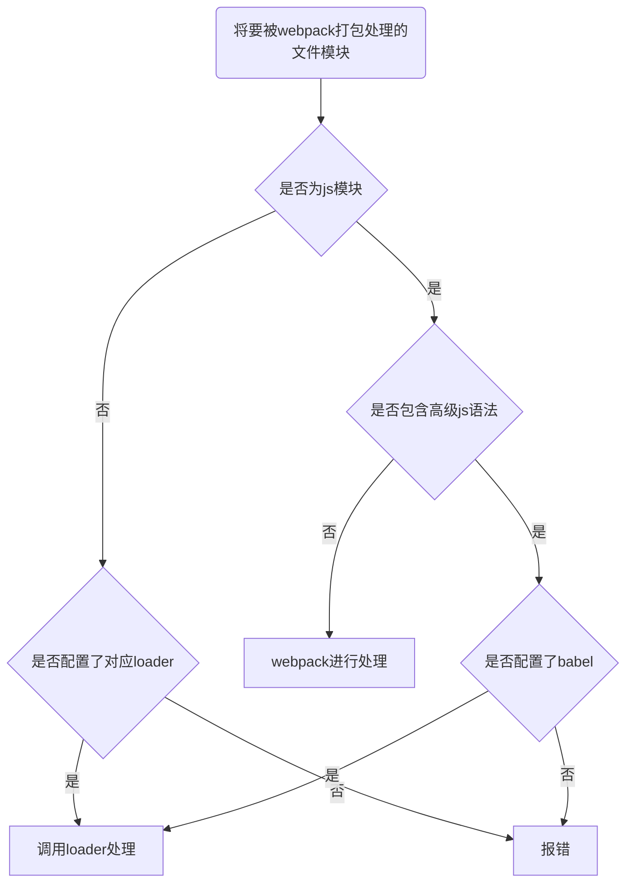

# 学习笔记

## webpack介绍
1. 概念：webpack是前端项目工程化的具体解决方案
2. 主要功能：
    - 它提供了友好的模块化开发支持
    - 代码压缩混淆
    - 处理浏览器段JavaScrpt的兼容性，如let定义变量时，IE浏览器不兼容，但可以被转换成var
    - 性能优化
    - 其它强大的功能。
3. 好处：把工作重心转移到具体功能实现上，提高了前端开发效率和项目的可维护性。
4. 注意： 目前vue，React等前端项目，基本上都是基于webpack进行工程化开发的。

---

## webpack的作用，什么是工程化？
- 模块化 - js的模块化、css的模块化、资源的模块化；

- 组件化 - 复用现有的UI结构、样式、行为；

- 规范化 - 目录结构的划分、编码规范化、接口规范化、文档规划化、Git分支管理；

- 自动化 - 自动化构建、自动部署、自动化测试

---

## 在项目中安装 webpack
```bash
npm install webpack@5.42.1 webpack-cli@4.7.2 -D
# @ 符号用于指定版本号
# -D 用于写入包，将会写在 package.json 中的 devDependencies 节点
# 部分
```

---

## package.json 中 devDependencies 与 Dependencies 区别
- devDependencies是开发环境，Dependencies 是 开发环境 和 线上环境
- 在命令行终端中参数 -D 代表开发环境，是 --save-dev 的简写
- 在命令行终端中参数 -S 代表线上环境，是 --save 的简写

### 如何确定包要安装到哪个环境？

可以在[npm](http://npmjs.com)的官网中查看搜索

例如安装 `webpack`，命令中有提示安装的环境：
```bash
#Install with npm:

npm install --save-dev webpack
```

---

## 在项目中配置 webpack
1. 在项目根目录中，创建名为`webpack.config.js`的webpack配置文件，并初始化如下的基本配置：
```js
//在node中向外导出一个配置对象，供webpack使用
    module.exports={
        mode: 'development'//mode 用来指定构建模式，可选的值有 development 和 production，分别代表开发环境和发布上线环境
    }
```
2. 在 `package.json`的json节点下，新增dev脚本如下：
```js
"script": {
    "dev": "webpack"//script 节点下的脚本，可以通过 npm run 执行。如npm run dev，意为运行名为 dev 的脚本，在脚本中名字可以是任意合法的英文名。webpack是执行的命令
}
```
3. 在终端中运行`npm run dev`命令，启动webpack进行项目的打包构建
4. 运行后会生成`main.js`，默认在`dist`目录下。`main.js`会包含`index.js`及其引入的JavaScript代码

---

## `webpack.config.js`中`module.exports mode`可选值的应用场景
- development 开发环境，没有进行代码压缩，打包时间快。
- production 线上环境，有对代码进行压缩混淆，打包时间变长，**注释消失**。

---

## 当执行`npm run dev`时（也就是打包构建之前），会运行`dev`脚本会先读取`webpack.config.js`配置文件，获取到运行模式后，基于配置对项目进行打包

---

## `webpack 4.x`和`webpack 5.x`的版本中有如下默认规定：
1. 默认的打包入口文件为`src -> index.js`
    - 当无法找到`index.js`时会导致报错
2. 默认的输出文件路径为`dist -> main.js`
3. 可以在`webpack.config.js`中修改打包的默认约定

---

## 在`webpack.config.js`配置文件中，通过`entry`节点指定`打包的入口`。通过`output`节点指定`打包的出口`代码如下：
```js
//导入node.js中专门操作路径的模块，用require导入
const path = require('path')

//__dirname代表当前文件的存放路径
module.exports = {
    //打包入口文件的路径
    entry: path.join(__dirname, './src/index.js'),
    //输出文件的存放路径
    output: {
        path: path.join(__dirname, './dist'),
        //输出文件的名称
        filename: 'bundle.js'
    }
}
```

---

## 每当修改代码，就要重新打包，可以安装webpack插件进行自动打包。最常用的有如下两个：
1. `webpack-dev-server`:
    - 类似于node.js用到的 nodemon 工具
    - 每当修改了源代码，webpack 会自动进行项目的打包和构建
    - 运行如下命令，在项目中安装此插件（开发环境）：
    ```bash
    npm install webpack-dev-server@3.11.2 -D
    ``` 

2. `html-webpack-plugin`:
    - webpack 中的 HTML 插件（类似于一个模板引擎插件）
    - 可以通过此插件自定义 index.html 页面的内容
    - 运行如下的命令，即可在项目中安装此插件：
    ```bash
    npm install html-webpack-plugin@5.3.2 -D
    ```
---

## 配置webpack-dev-server

1. 修改`package.json -> scripts`中的`dev`命令如下：
```js
"script": {
    //script 节点下的脚本，可以通过npm run执行
    "dev": "webpack serve"
}
```
2. 再次运行`npm run dev`命令，重新进行项目的打包
3. 在浏览器中访问`http://localhost:8080`地址，插件自动打包效果

注意：
- webpack-dev-server会启动一个`实时打包的http服务器`
- 需要访问`http://localhost:8080`才能看到效果
- 输出的js文件会在网址的根目录，没有在磁盘上，资源管理器无法找到，在内存中。
- 修改代码保存后，会自动刷新浏览器。

---

## 配置html-webpack-plugin，在`webpack.config.js`中

```js
//1. 导入插件，得到一个构造函数
const HtmlPlugin = require('html-webpack-plugin')

//2. 创建 HTML 插件的实例对象
const htmlPlugin = new HtmlPlugin({
    //指定源文件的存放路径
    template: './src/index',
    //指定生成的文件的存放路径
    filename: ./index.html,
})

module.exports = {
    name: 'development',
    //通过 plugins 节点，使htmlPlugin 插件生效
    plugins: [htmlPlugin],
}
```

---

## html-webpack-plugin插件的特性
- 可以把复制的html文件放到内存里 
- 在复制出来的、内存里的`index.html`自动添加内存中的js脚本到`<head>`标签内。也就是说自动注入了打包的`main.js`文件，再也无需手动修改页面的引入脚本。

---

## `webpack.config.js`中，用devServer节点对webpack-dev-server插件进行更多的配置
```js
devServer: {
    //初次打包完成后，自动打开浏览器
    open: true,
    //实时打包所使用的主机地址
    host: '127.0.0.1',
    //实时打包所使用的端口号
    port: 80,
}
```
**每当修改了wepback.config.js配置文件，或者package.json配置文件，必须重启实时打包的服务器，否则最新的配置文件无法生效！**

---

## webpack中的loader

webpack默认只能打包`.js`后缀名结尾的模块，非`.js`后缀名结尾的模块，webpack默认处理不了，需要调用`loader`加载器才可以正常打包，否则会报错！

### loader加载器的作用
协助webpack打包处理特定的文件模块，比如：
- css-loader 可以打包处理.css相关的文件
- less-loader 可以打包处理.less相关的文件
- babel-loader 可以打包处理webpack无法处理的高级js语法



在`index.js`中的如下语句，需要配置加载器
```js
//导入样式（在webpack中，一切皆模块，都可以通过ES6导入语法进行导入和使用）
import './css/index.css'
```
否则会报错：
```
ERROR in ./src/css/index.css 1:3
Module parse failed: Unexpected token (1:3)
You may need an appropriate loader to handle this file type, currently no loaders are configured to process this file. See https://webpack.js.org/concepts#loaders
> li {
|     list-style: none;
| }
 @ ./src/index.js 6:0-24

webpack 5.75.0 compiled with 1 error in 38 ms
```

---

### 配置css-loader打包处理css文件

1. 安装处理css文件的loader：
```bash
npm i style-loader@3.0.0 css-loader@5.2.6 -D
```

2. 在`webpack.config.js`的`module -> rules`数组中，添加loader规则如下：
```js
module: {
    // 所有第三方文件模块的匹配规则
    //文件后缀名的匹配规则
    rules: [
        {test: /\.css$/, use: ['style-loader', 'css-loader']}
    ]
}
```

`/\.css$/`为正则表达式，`\`是把`.`转义，`$`是结尾。该意义为匹配以`.css`结尾的文件。

其中，`test`表示匹配的文件类型，`use`表示对应`要调用的loader`

注意：
- use数组中指定的loader`顺序是固定的`
- 多个loader的调用顺序是`从后往前调用`

在如下代码中：
```js
//导入样式（在webpack中，一切皆模块，都可以通过ES6导入语法进行导入和使用）
import './css/index.css'
```
1. webpack默认只能打包处理`.js`结尾的文件，处理不了其它后缀的文件。
2. 由于代码中包含了`index.css`这个文件，因此webpack默认处理不了。
3. 当webpack发现某个文件处理不了的时候，会查找`webpack.config.js`这个配置文件，看`module.rules`数组中，是否配置了对应的loader加载器。

```js
module: {
    rules:[
        {test: /\.css$/, use: ['style-loader', 'css-loader']}
    ]
}
```
4. webpack把index.css这个文件，`先`转交给`css-loader`处理。
5. 当`css-loader`处理完毕后，会把处理结果转交给下一个loader，`style-loader`。
6. 当style-loader处理完毕后，发现没有下一个loader，把结果转交给webpack
7. webpack把style-loader处理的结果，合拼到输出的文件中`/dist/main.js`中，最终生成打包好的文件。

**因此，use 数组中的顺序是从后往前的**

---

### 打包处理less文件，需要less-loader
1. 运行如下命令安装less-loader：
```bash
npm i less-loader@10.0.1 less@4.1.1 -D
```
2. 在webpack.config.js的`module -> rules`数组中，添加loader规则如下：
```js
module: {
    rules:[
        {test: /\.less$/, use: ['style-loader', 'css-loader', 'less-loader']}
    ]
}
```

**less是less-loader的内置依赖项，无需写在rules中声明**

---

### 打包处理样式表中与`url路径`相关的文件

1. 运行如下命令：
```bash
npm i url-loader@4.1.1 file-loader@6.2.0 -D
```
2. 在webpack.config.js的`module -> rules`数组中，添加loader规则如下：
```js
module: {
    rules:[
        {test: /\.jpg|png|gif$/, use: 'url-loader?limit=22229'},
    ]
}
```
其中，`?`之后的是`loader的参数项`：
- limit用来指定`图片的大小`，单位是字节（byte）
- 只有`≤`limit大小的图片，才会被转为base64格式的图片

---

### webpack处理打包js文件中的高级语法

webpack只能打包处理`一部分`高级的JavaScript语法。对于那些webpack无法处理的高级js语法，需要借助于`babel-loadder`进行打包处理。例如webpack无法处理下面的Javascript代码：
```js
//1.定义了名为info的修饰器
function info(target) {
    //2.为目标添加静态属性info
    target.info = 'Person info'
}

//3.为Person类应用info修饰器
@info
class Person{}

//4.打印Person的静态属性info
console.log(Person.info)
```

---

### 安装babel-loader 相关的包
运行如下的命令安装对应的依赖包：
```bash
npm i babel-loader@8.2.2 @babel/core@7.14.6 @babel/plugin-proposal-decorators@7.14.5 -D
```

在webpack.config.js的`module->rules`数组中，添加loader规则如下：
```js
//注意：必须使用exclude指定排除项，因为node_modules 目录下的第三包不需要被打包，无需考虑第三包兼容性问题，否则打包速度会很慢或者项目无法启动
{test: /\.js$/, use: 'babel-loader', exclude: /node_modules/}
```

---

#### 配置babel-loader

在项目根目录下，创建名为`babel.config.js`的配置文件，定义`Babel的配置项`如下：
```js
module.exports = {
    //声明babel可用的插件
    plugins:[['@babel/plugin-proposal-decorators', {legacy: true}]]
}
```

详情请参考Babel的官网(https://babeljs.io/docs/en/babel-plugin-proposal-decorators)

---

## 配置webpack的打包发布

在`package.json`文件的`scripts`节点下，新增build命令如下：
```js
"script": {
    //开发环境中，运行dev命令
    "dev": "webpack serve",
    //项目发布时，运行build命令
    "build": "webpack --mode production"
}
```

`--model`是一个参数项，用来指定webpack的`运行模式`。production代表生产环境，会对打包生成的文件进行`代码压缩`和`性能优化`。

**注意：通过--model指定的参数项，会`覆盖`webpack.config.js中的model选项。**

webpack --mode production命令将会把webpack-dev-server在内存中的文件输出，供后端使用。

---

### 打包发布对文件进行分类到文件夹

1. 把JavaScript文件统一生成到js目录中
在`webpack.config.js`配置文件中的`output`节点中，进行如下配置：
```js
output: {
    path: path.join(__dirname, 'dist'),
    //明确告诉webpack把生成的js文件存放到dist目录下的js子目录中
    filename: 'js/main.js'
}
```

2. 把图片文件统一生成到image目录中
修改webpack.config.js中的`url-loader`配置项，新增`outputPath`选项即可指定图片文件的输出路径：
```js
{
    test: /\.jpg|png|gif$/,
    use: {
        loader: 'url-loader',
        options: {
            limit: 22228,
            outputPath: 'image',
        },
    },
}
```

也可以使用类似于url参数的方法进行配置：
```js
{test: /\.jpg|png|gif$/, use: 'url-loader?limit=28888&outputPath'},
```

**每次生成文件建议删除整个dist输出文件夹后再生成，不然有些旧文件还会存在，可能会在不同目录下，导致混淆。**

---

### 每次发布时，`自动清理`dist目录中的旧文件，可以安装并配置`clean-webpack-plugin`插件：

1. 终端运行命令：
```bash
npm install clean-webpack-plugin@3.0.0 -D
```

2. 在`webpack.config.js`中配置插件：
```js
//按需导入插件、得到插件的构造函数之后，创建插件的实例对象
const {CleanWebpackPlugin} = require('clean-webpack-plugin')
const cleanPlugin = new CleanWebpackPlugin()

//把创建的 cleanPlugin 插件实例对象，挂载到plugins节点中

plugins: [htmlPlugin, cleanPlugin],//挂载插件
```
建议查询文档，在npm官网搜索`clean-webpack-plugin`，详见(https://npmjs.com/package/clean-webpack-plugin)

为什么const {CleanWebpackPlugin} = require('clean-webpack-plugin')里，需要用{}获取对象？

这是一个解构赋值，通过console.log得知，相当于如下：
```js
const {CleanWebpackPlugin} = {CleanWebpackPlugin: funciton(){}}
```

---

### 总结

[黑马程序员Vue全套视频教程 P26,01:39](https://www.bilibili.com/video/BV1zq4y1p7ga)
1. 在package.json新建名为build的脚本，执行的命令为webpack --mode production，进行打包发布，如果省缺mode不会对代码进行压缩混淆。
2. 让js文件输出到js文件夹，在webpack.config.js配置文件中的output.filename节点内，添加一个js路径。
3. 让图片输出到image文件夹，在webpack.config.js中module.rules的url-loader配置use，有url参数配置方法和json配置方法，添加outputPath选项即可。
4. 每次发布文件，自动删除输出的旧文件，安装配置clean-webpack-plugin插件即可。